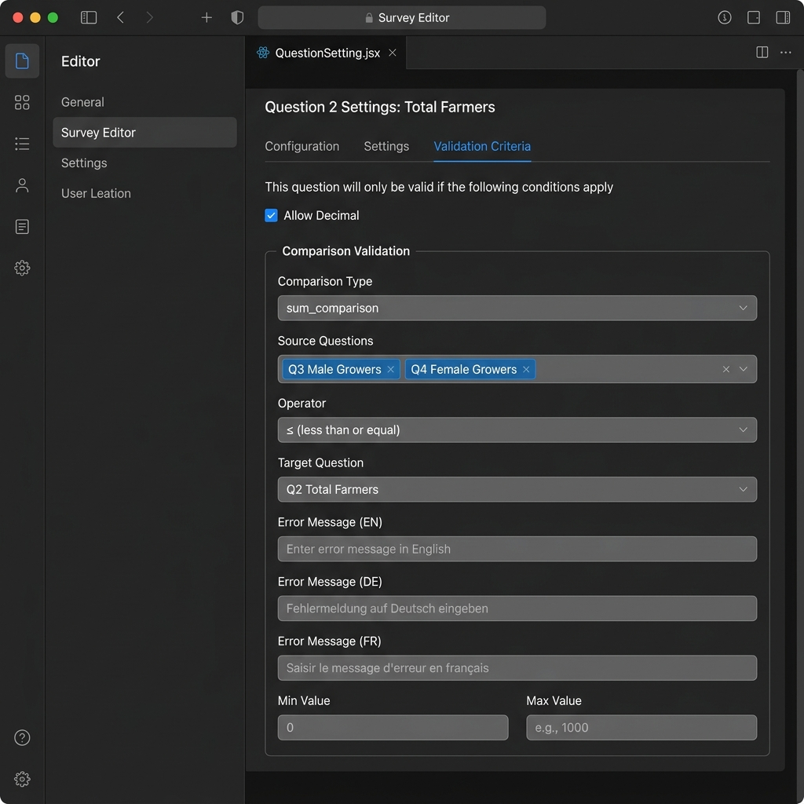
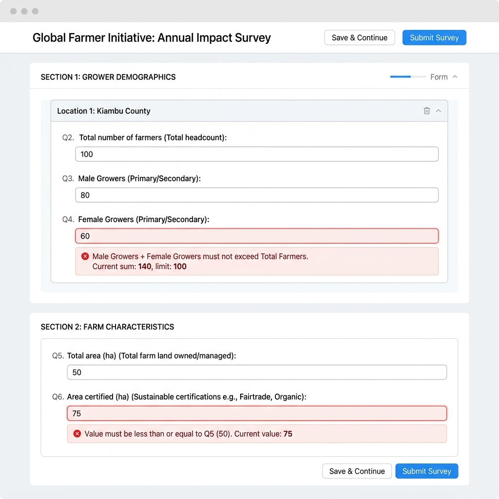

# Feature Specification: Survey Validations & Dynamic Placeholders

This document specifies the technical design, configuration changes, and implementation plan for adding dynamic placeholders and immediate inline numerical validations to the survey form system.

---

## 0. Related Files

Below is a complete inventory of every file touched by this feature, grouped by concern.

### Backend

| File | Role |
|------|------|
| [`backend/source/config/test/computed_validations.json`](../backend/source/config/test/computed_validations.json) | Test-env sum-to-100% config used by `/config.js` endpoint |
| [`backend/source/config/local/computed_validations.json`](../backend/source/config/local/computed_validations.json) | Local-dev environment config |
| [`backend/source/config/production/computed_validations.json`](../backend/source/config/production/computed_validations.json) | Production environment config |
| [`backend/core/config.py`](../backend/core/config.py) | `/config.js` FastAPI endpoint — reads the correct `computed_validations.json` by `BUCKET_FOLDER` env var and injects it as `window.computed_validations` |
| [`backend/routes/data.py`](../backend/routes/data.py) | Contains the **commented-out** `check_computed_validation()` function (server-side) and the `get_questions_from_published_form()` helper that populates `computed_validation_questions` per user role |

### Frontend – Survey Webform

| File | Role |
|------|------|
| [`frontend/src/pages/survey/WebformPage.jsx`](../frontend/src/pages/survey/WebformPage.jsx) | Consumes `window.computed_validations`; runs `checkComputedValidationFunction` on submit and shows `ValidationWarningModal` |
| [`frontend/src/components/notification-modal/ValidationWarningModal.jsx`](../frontend/src/components/notification-modal/ValidationWarningModal.jsx) | Modal that renders the computed-validation error details |
| [`frontend/src/akvo-react-form/fields/TypeNumber.jsx`](../frontend/src/akvo-react-form/fields/TypeNumber.jsx) | **To be modified** — `NumberField` will get the new inline comparison validator |
| [`frontend/src/akvo-react-form/fields/TypeCascade.jsx`](../frontend/src/akvo-react-form/fields/TypeCascade.jsx) | **To be modified** — pass `variable_name` down to `TypeCascadeApi` |
| [`frontend/src/akvo-react-form/fields/TypeCascadeApi.jsx`](../frontend/src/akvo-react-form/fields/TypeCascadeApi.jsx) | **To be modified** — `CascadeApiField` reads `variable_name` at level 0 to set a custom placeholder |

### Frontend – Locale / Translations

| File | Role |
|------|------|
| [`frontend/src/akvo-react-form/locale/en.json`](../frontend/src/akvo-react-form/locale/en.json) | Add `selectCountry`, `selectPartner` |
| [`frontend/src/akvo-react-form/locale/de.json`](../frontend/src/akvo-react-form/locale/de.json) | Add `selectCountry`, `selectPartner` |
| [`frontend/src/akvo-react-form/locale/fr.json`](../frontend/src/akvo-react-form/locale/fr.json) | Add `selectCountry`, `selectPartner` |
| [`frontend/src/akvo-react-form/locale/id.json`](../frontend/src/akvo-react-form/locale/id.json) | Add `selectCountry`, `selectPartner` |
| [`frontend/src/akvo-react-form/locale/in.json`](../frontend/src/akvo-react-form/locale/in.json) | Add `selectCountry`, `selectPartner` |
| [`frontend/src/akvo-react-form/locale/index.js`](../frontend/src/akvo-react-form/locale/index.js) | Locale barrel file (no change needed unless new locale is added) |

### Frontend – Survey Editor

| File | Role |
|------|------|
| [`frontend/src/components/survey-editor/QuestionSetting.jsx`](../frontend/src/components/survey-editor/QuestionSetting.jsx) | **To be modified** — adds Comparison Validation UI block inside the "Validation Criteria" `TabPane` |
| [`frontend/src/components/survey-editor/QuestionTabContent.jsx`](../frontend/src/components/survey-editor/QuestionTabContent.jsx) | Renders `QuestionSetting`; may need `rule` prop threading if not already passed |

---

## 1. Requirements

### 1.1 Immediate Inline Numerical Validations
We need to support immediate numerical comparisons on value change instead of waiting for form submission:
1. **Q6 ≤ Q5 Comparison**: The response to Question 6 must be less than or equal to the response to Question 5.
2. **Q3 (Male Growers) + Q4 (Female Growers) ≤ Q2 (Total Farmers)**: The sum of Q3 and Q4 must not exceed the total value in Q2.
3. **Q3 (Male Growers) ≤ Q2 (Total Farmers)**: The response to Q3 must be less than or equal to Q2.

*Note: For repeatable question groups, comparisons must be computed within the same repeat index iteration (e.g., Q6-1 ≤ Q5-1, Q6-2 ≤ Q5-2, etc.).*

### 1.2 Delayed Sum-to-100% Validation
- We confirmed that the sum-to-100% validation check already runs exclusively on submission (inside `onSubmitValidationOrShowSubmitWarning` in `WebformPage.jsx`). This behavior matches the user's preference and will be preserved.

### 1.3 Dynamic Cascade Dropdown Placeholders
For dynamic cascading API-driven select fields (e.g., country and partner selections):
- **Country field (Level 1)**: Display "select country" (EN) / "Land auswählen" (DE) / "Sélectionner le pays" (FR).
- **Partner field (Level 1)**: Display "select partner" (EN) / "Partner auswählen" (DE) / "Sélectionner le partenaire" (FR).
- Subsequent levels will continue to use the standard "Select level {N}" text.

---

## 2. Technical Design

### 2.1 Database Schema Representation (`question.rule`)
To support dynamic comparisons configurable via the survey editor UI, validation rules are stored directly inside the generic JSONB `rule` column of the `question` table.

The `rule` JSON object for a question with comparison validations will contain the following keys:
- `comparison_type`: `"None" | "comparison" | "sum_comparison"`
- `comparison_operator`: `"less_than_or_equal" | "greater_than_or_equal" | "equal"`
- `comparison_target`: ID of the target numeric question.
- `comparison_sources`: Array of numeric question IDs to sum (only for `sum_comparison`).
- `comparison_message`: Localized error message in English.
- `comparison_message_de`: Localized error message in German.
- `comparison_message_fr`: Localized error message in French.

#### Example `rule` object on a comparison source question (e.g. Q6):
```json
{
  "allow_decimal": true,
  "min": 0,
  "comparison_type": "comparison",
  "comparison_operator": "less_than_or_equal",
  "comparison_target": 5,
  "comparison_message": "Answer must be less than or equal to Question 5",
  "comparison_message_de": "Der Wert muss kleiner oder gleich der Antwort auf Frage 5 sein",
  "comparison_message_fr": "La valeur doit être inférieure ou égale à celle de la question 5"
}
```

### 2.2 How `computed_validations.json` Logic is Handled in the Frontend

This is the central sum-to-100% (or max/min) validation mechanism for specific question groups across multiple forms. Here is a full trace from config file to UI:

#### Step 1 — Configuration File (`computed_validations.json`)
Each environment folder (`local/`, `test/`, `production/`) holds its own copy of this JSON file. The file is an array of **per-form validation rules**:

```json
[
  {
    "form_id": 4,
    "validations": [
      {
        "group_id": 14,
        "question_ids": [634, 635],
        "max": 100
      },
      {
        "group_id": 18,
        "question_ids": [638, 639],
        "equal": 100
      }
    ]
  }
]
```

Each validation entry supports three operators:
| Key | Meaning |
|-----|---------|
| `max` | Sum of `question_ids` answers must be **≤ max** |
| `min` | Sum of `question_ids` answers must be **≥ min** |
| `equal` | Sum of `question_ids` answers must be **exactly equal** (e.g. 100% check) |

#### Step 2 — Backend Injection (`backend/core/config.py`)
The `/config.js` endpoint reads the file for the current `BUCKET_FOLDER` env and minifies it into a global JS variable:

```python
computed_validation = f"{CONFIG_SOURCE_PATH}/computed_validations.json"
min_js = jsmin("var computed_validations=" + open(computed_validation).read() + ";")
```

This is served as a static JS file and loaded by the frontend HTML page, making `window.computed_validations` available globally at runtime.

#### Step 3 — Frontend Consumption (`WebformPage.jsx`)
At module level, `WebformPage.jsx` reads the global variable:
```js
const computedValidations = window?.computed_validations;
```

The `checkComputedValidationFunction` callback:
1. Looks up the current `form_id` entry in `computedValidations`.
2. Cross-references `group_id` and `question_ids` against the **user's visible questions** (filtered by member/isco type) using lodash `intersection`.
3. For each answer group (supporting repeatable groups, keyed as `groupId_repeatIndex`), it sums the numeric answers of the relevant question IDs.
4. Compares the total against `max`, `min`, or `equal` — and collects errors.
5. Called with `onChangeEvent = false` inside `onSubmitValidationOrShowSubmitWarning` to block submission.
6. If errors exist, `ValidationWarningModal` is shown with a breakdown per group.

#### Step 4 — Validation Warning Modal (`ValidationWarningModal.jsx`)
Renders a collapsible panel per failed group, listing question names, their answers, the current total, and the expected constraint value (via `text.cvMaxValueText`, `text.cvMinValueText`, `text.cvEqualValueText`).

---

### ⚠️ Two Validation Systems — They Are NOT Interchangeable

This is the most important conceptual boundary in the entire feature. The two systems look similar on the surface (both involve "summing questions") but they solve fundamentally different problems. **You should never configure the same validation in both.**

#### System 1 — `computed_validations.json` (existing, submission-time)

> **"The sum of a fixed set of questions must equal / not-exceed a *hardcoded constant*."**

```
sum(Q634 + Q635)                       <= 100   ← target is a static number
sum(Q670 + Q671 + Q673 + Q660)         == 100   ← percentage breakdown must total 100
sum(Q897 + Q898 + Q899 + Q900)         == 100   ← another percentage group
```

**Key traits:**
- Target is always a **hardcoded number** (`max`, `min`, or `equal` field in JSON)
- These are **percentage breakdown questions** — e.g. "What % of growers are female?", "What % are certified?" — where all the sub-questions must collectively add up to 100%
- Configured in a **static JSON file** per environment, not in the survey editor
- Fires **only on form submission** — the user sees a modal popup
- Adding a new form/group requires editing `computed_validations.json` and redeploying

#### System 2 — `comparison_type` in `question.rule` (new, inline)

> **"This question (or the sum of a set of source questions) must be ≤ / ≥ / = *another question's live answer*."**

```
Q6 (certified area)                    <=  Q5 (total area)          ← target is Q5's value
Q3 (male growers) + Q4 (female growers) <=  Q2 (total farmers)      ← target is Q2's value
Q3 (male growers)                       <=  Q2 (total farmers)
```

**Key traits:**
- Target is always **another question's dynamic value** (`comparison_target` = a question ID)
- These are **logical integrity constraints** — a sub-count cannot exceed the total count
- Configured **per-question inside the survey editor UI**, stored in `question.rule` (DB)
- Fires **immediately on value change** — the user sees a red inline error below the field
- Adding a new constraint requires editing the question's rule in the survey editor

#### Decision Matrix

| Scenario | Use which system? | Reason |
|---|---|---|
| Q634 + Q635 must add up to ≤ 100 | `computed_validations.json` | Target is the fixed number 100 |
| Q670 + Q671 + Q673 + Q660 must equal 100% | `computed_validations.json` | Target is the fixed number 100 |
| Q3 male + Q4 female must not exceed Q2 total | `sum_comparison` in `question.rule` | Target is Q2's live answer |
| Q6 area certified must not exceed Q5 total area | `comparison` in `question.rule` | Target is Q5's live answer |

> [!IMPORTANT]
> The questions listed in `computed_validations.json` (e.g. Q634, Q635, Q670–Q673, Q897–Q900) do **NOT** need `comparison_type` set in their `question.rule`. They are already validated by the submission-time system. Setting `sum_comparison` on them would be redundant and would fire a confusing inline error for a percentage-breakdown question where intermediate states (e.g. only one field filled) are perfectly valid.

#### Mockup: Question Setting (Survey Editor)

The new **Comparison Validation** block is added to the existing "Validation Criteria" `TabPane` in `QuestionSetting.jsx`, visible only for `type === "number"` questions:



**Field mapping to `question.rule` keys:**

| UI Field | Form item name pattern | Saved as `rule` key |
|---|---|---|
| Comparison Type dropdown | `question-{qid}-rule-comparison_type` | `comparison_type` |
| Source Questions multi-select | `question-{qid}-rule-comparison_sources` | `comparison_sources` |
| Operator dropdown | `question-{qid}-rule-comparison_operator` | `comparison_operator` |
| Target Question dropdown | `question-{qid}-rule-comparison_target` | `comparison_target` |
| Error Message (EN) | `question-{qid}-rule-comparison_message` | `comparison_message` |
| Error Message (DE) | `question-{qid}-rule-comparison_message_de` | `comparison_message_de` |
| Error Message (FR) | `question-{qid}-rule-comparison_message_fr` | `comparison_message_fr` |

The "Source Questions" field only appears when `comparison_type === "sum_comparison"`. When `comparison_type` is set back to `"None"`, all comparison fields are reset.

#### Mockup: Webform – Inline Validation Errors

Errors appear immediately below the answer input field as Ant Design form validation messages:



Inside `TypeNumber.jsx`, the `NumberField` component uses `<Form.Item dependencies={[...targetOrSourceKeys]}>` so the validator re-runs reactively when related fields change:

```jsx
<Form.Item
  name={id}
  dependencies={comparisonDeps}  // [targetKey] or [sourceKey1, sourceKey2, ...]
  rules={[
    ...rules,
    {
      validator: (_, value) => {
        if (!value && value !== 0) return Promise.resolve();
        if (naChecked) return Promise.resolve();

        const fieldValues = form.getFieldsValue();
        if (rule?.comparison_type === "comparison") {
          const targetValue = fieldValues[targetKey];
          if (targetValue === undefined || targetValue === null) return Promise.resolve();
          const passes = compareValues(value, targetValue, rule.comparison_operator);
          if (!passes) return Promise.reject(new Error(localizedMessage));
        }
        if (rule?.comparison_type === "sum_comparison") {
          const sum = sourceKeys.reduce((acc, k) => acc + (fieldValues[k] ?? 0), 0);
          const targetValue = fieldValues[targetKey];
          if (targetValue === undefined || targetValue === null) return Promise.resolve();
          const passes = compareValues(sum, targetValue, rule.comparison_operator);
          if (!passes) return Promise.reject(new Error(localizedMessage));
        }
        return Promise.resolve();
      }
    }
  ]}
>
```

For **repeatable groups**, the field IDs are scoped by repeat index (e.g. `48-1`, `49-1`), so the target key is resolved as `${targetQuestionId}-${repeatIndex}`.

### 2.3 Number Field Validations (`TypeNumber.jsx`)
We will update `NumberField` (in `TypeNumber.jsx`) to:
1. Access the `rule` object passed directly as a prop to the question component.
2. Resolve target and source field keys scoped to the repeat index:
   - For repeatable question groups (e.g., field ID is `48-1`), resolve the target question (e.g., ID 49) to `49-1`.
   - For non-repeatable groups, resolve it to the integer ID (e.g., `49`).
3. Construct the `dependencies` array of `<Form.Item>` to contain the target/source field keys. This ensures Ant Design reactively re-evaluates the validator when any related field is changed.
4. Implement a custom `validator` function:
   - Skip validation if the field value is empty or `n/a` is checked.
   - Evaluate the comparison operator against the target value (and sum of source values if `sum_comparison`).
   - Reject the Promise with the corresponding localized warning message if evaluation fails.

### 2.4 Survey Editor UI (`QuestionSetting.jsx`)
In the survey editor:
1. Under the **Validation Criteria** tab for numeric questions, we render form inputs for comparison configuration:
   - **Comparison Type**: Dropdown select with options `None`, `comparison`, and `sum_comparison`.
   - **Sources** (if type is `sum_comparison`): Multi-select listing all other numeric questions.
   - **Operator**: Dropdown select with options `<=`, `>=`, `==`.
   - **Target Question**: Dropdown select listing all other numeric questions.
   - **Error Messages**: Inputs for custom localized error messages (English, German, French).
2. When the Comparison Type changes to `"None"`, any comparison fields are cleared/reset.
3. Form values mapped to `question-${qid}-rule-${key}` are automatically parsed and saved back to the database as part of the question's `rule` object.

### 2.5 Cascade Dynamic Placeholders (`TypeCascade.jsx` / `TypeCascadeApi.jsx`)
1. Propagate `variable_name` from `TypeCascade` to `TypeCascadeApi` and into `CascadeApiField`.
2. Inside `CascadeApiField`, check if the select field is level 1 (`ci === 0`) and check the `variable_name`:
   - If `"country"`: Set placeholder to `uiText.selectCountry`.
   - If `"partner"`: Set placeholder to `uiText.selectPartner`.
   - Otherwise, default to standard `${uiText.selectLevel} ${ci + 1}`.

### 2.6 Localization Updates
We will add keys to locale files inside `frontend/src/akvo-react-form/locale/`:
- **English (`en.json`)**:
  - `"selectCountry": "select country"`
  - `"selectPartner": "select partner"`
- **German (`de.json`)**:
  - `"selectCountry": "Land auswählen"`
  - `"selectPartner": "Partner auswählen"`
- **French (`fr.json`)**:
  - `"selectCountry": "Sélectionner le pays"`
  - `"selectPartner": "Sélectionner le partenaire"`
- **Indonesian (`id.json`)**:
  - `"selectCountry": "Pilih Negara"`
  - `"selectPartner": "Pilih Mitra"`
- **Hindi (`in.json`)**:
  - `"selectCountry": "देश चुनें"`
  - `"selectPartner": "साझेदार चुनें"`

---

## 3. Effort Estimation

> [!NOTE]
> All estimates assume **1 developer working with an AI coding assistant** (pair-programming mode). Estimates cover implementation + inline unit tests only. QA/UAT time is listed separately under Epic 3.

### Summary Table

| Epic | Estimate |
| ---- | -------- |
| Epic 1 — Inline Cross-Question Numerical Validations | **7–9 h** |
| Epic-2 — Comparison Validation UI in Survey Editor | **6–8 h** |
| Epic 3 — Dynamic Cascade Placeholders + Locale | **4–5 h** |
| Epic 4 — QA, Manual Verification & Regression | **5–6 h** |
| **Total** | **~22–28 h** |

---

### Epic 1 — Inline Cross-Question Numerical Validations

**Files:** `TypeNumber.jsx`
**Estimate:** 7–9 h

**Description:**
Add an on-value-change validator inside `NumberField` that reads `question.rule` and immediately shows a red inline error when a comparison constraint is violated. Supports both single-question comparison (`comparison`) and sum-of-sources comparison (`sum_comparison`), scoped to the correct repeat-group index.

#### User Acceptance Criteria (UAC)

- [ ] When Q6 > Q5, a red error message appears immediately below the Q6 input without requiring form submission.
- [ ] The error message uses the language currently active in the UI (EN / DE / FR).
- [ ] The error disappears automatically when Q6 is reduced to ≤ Q5, or when Q5 is increased to ≥ Q6.
- [ ] When Q3 + Q4 > Q2, a red error appears immediately below Q4 (the configured source question).
- [ ] Inside a repeatable group, row 1 validations (Q6-1 vs Q5-1) are completely independent from row 2 (Q6-2 vs Q5-2).
- [ ] Checking the **n/a** ("Data unavailable") checkbox on a question suppresses its comparison validation entirely.
- [ ] An empty/unanswered source or target question does not trigger a false validation error.

#### Technical Acceptance Criteria (TAC)

- [ ] `NumberField` reads `rule.comparison_type` to determine which branch to execute (`"comparison"` vs `"sum_comparison"` vs `"None"`).
- [ ] Target field key is resolved as `${rule.comparison_target}-${repeatIndex}` for repeatable groups, or `rule.comparison_target` (integer) for non-repeatable groups.
- [ ] Source field keys (for `sum_comparison`) follow the same repeat-index scoping.
- [ ] The `<Form.Item>` wrapping the input declares a `dependencies` prop containing all resolved target/source keys so Ant Design re-runs the validator reactively.
- [ ] The custom validator skips (returns `Promise.resolve()`) when `value` is `undefined`/`null`, or `naChecked === true`.
- [ ] The error message is selected from `rule.comparison_message` (EN), `rule.comparison_message_de` (DE), `rule.comparison_message_fr` (FR) using the active language from the store.
- [ ] No changes are made to the `computed_validations.json` system or `checkComputedValidationFunction`.

---

### Epic 2 — Comparison Validation UI in Survey Editor

**Files:** `QuestionSetting.jsx`
**Estimate:** 6–8 h

**Description:**
Extend the existing **Validation Criteria** tab (visible for `type === "number"` questions) with a new "Comparison Validation" block. Fields map directly to keys in `question.rule` via the existing `question-${qid}-rule-*` naming convention so they are auto-persisted with zero additional API changes.

#### User Acceptance Criteria (UAC)

- [ ] A "Comparison Validation" section is visible inside the Validation Criteria tab for all numeric questions.
- [ ] The **Comparison Type** dropdown offers three options: `None`, `comparison`, `sum_comparison`.
- [ ] When `sum_comparison` is selected, a **Source Questions** multi-select appears, listing all other numeric questions in the form.
- [ ] When `comparison` or `sum_comparison` is selected, an **Operator** dropdown (`≤`, `≥`, `=`) and a **Target Question** dropdown appear.
- [ ] Three text inputs are shown for localized error messages: EN, DE, FR.
- [ ] When **Comparison Type is set back to `None`**, all comparison-related fields are cleared/reset.
- [ ] After saving and reopening the question, all previously configured values are correctly pre-populated.

#### Technical Acceptance Criteria (TAC)

- [ ] Form item names follow the pattern `question-${qid}-rule-comparison_type`, `…comparison_sources`, `…comparison_operator`, `…comparison_target`, `…comparison_message`, `…comparison_message_de`, `…comparison_message_fr`.
- [ ] The "Source Questions" `<Form.Item>` renders conditionally only when `form.getFieldValue(comparisonTypeField) === "sum_comparison"`.
- [ ] Operator and Target Question fields render when type is `"comparison"` or `"sum_comparison"`.
- [ ] On type change to `"None"`, `form.resetFields([...allComparisonFieldNames])` is called and `handleFormOnValuesChange` is triggered.
- [ ] Target and Source dropdowns filter to only `type === "number"` questions, excluding the question being configured.
- [ ] No new API endpoints or Pydantic model changes are required — the existing `rule` JSONB column handles all new keys.

---

### Epic 3 — Dynamic Cascade Placeholders + Locale Keys

**Files:** `TypeCascade.jsx`, `TypeCascadeApi.jsx`, `en.json`, `de.json`, `fr.json`, `id.json`, `in.json`
**Estimate:** 4–5 h

**Description:**
Propagate `variable_name` from the question definition down through the cascade component tree so that `CascadeApiField` can render a contextual placeholder at level 1 ("select country" / "select partner") instead of the generic "Select level 1".

#### User Acceptance Criteria (UAC)

- [ ] The country cascade field shows **"select country"** (EN), **"Land auswählen"** (DE), **"Sélectionner le pays"** (FR) before any selection is made.
- [ ] The partner cascade field shows **"select partner"** (EN), **"Partner auswählen"** (DE), **"Sélectionner le partenaire"** (FR).
- [ ] Levels 2 and beyond continue to show the generic **"Select level 2"**, **"Select level 3"**, etc.
- [ ] Switching the UI language updates the placeholder text immediately without a page reload.
- [ ] All other cascade fields (where `variable_name` is neither `"country"` nor `"partner"`) are unaffected.

#### Technical Acceptance Criteria (TAC)

- [ ] `TypeCascade` passes `variable_name` as a prop to `TypeCascadeApi`.
- [ ] `TypeCascadeApi` passes `variable_name` as a prop to `CascadeApiField` (both direct render and repeat-table render paths).
- [ ] Inside `CascadeApiField`, the `placeholder` for `ci === 0` is resolved as:
  - `variable_name === "country"` → `uiText.selectCountry`
  - `variable_name === "partner"` → `uiText.selectPartner`
  - otherwise → `` `${uiText.selectLevel} ${ci + 1}` ``
- [ ] All 5 locale files (`en.json`, `de.json`, `fr.json`, `id.json`, `in.json`) contain both `selectCountry` and `selectPartner` keys with correct translations.

---

### Epic 4 — QA, Manual Verification & Regression

**Estimate:** 5–6 h

**Description:**
End-to-end manual verification across all three epics using a local dev environment. Includes regression checks to ensure existing `computed_validations.json` submission-time checks are not affected.

#### User Acceptance Criteria (UAC)

- [ ] All UAC items from Epics 1, 2, and 3 are confirmed passing in the local dev environment.
- [ ] Submitting a form with a sum-to-100% violation (e.g. Q634 + Q635 ≠ 100) still shows the existing **ValidationWarningModal** popup — the submission-time check is unaffected.
- [ ] A form with no comparison rules configured shows no unexpected inline errors.

#### Technical Acceptance Criteria (TAC)

- [ ] Existing Jest test suite passes without regressions (`./dc.sh exec frontend yarn test`).
- [ ] ESLint passes with no new errors (`./dc.sh exec frontend yarn lint`).
- [ ] `checkComputedValidationFunction` in `WebformPage.jsx` produces identical output before and after the changes (no side-effects from Epic 1).

---

## 4. Verification Plan

### 4.1 Automated Testing
We will add front-end tests using the existing Jest/React Testing Library setup or backend route validation checks to verify configurations.

### 4.2 Manual Verification
We will verify the feature inside the application using a mock local form (e.g., `form_id` 100 or a specific dev form):

1. **Dynamic Placeholder**:
   - Inspect Country and Partner cascade fields before any selection.
   - Confirm placeholder text shows "select country" and "select partner" (and correct localized text when changing language to German/French).
2. **Inline Validation**:
   - Change values of Q5 and Q6. Confirm that if Q6 > Q5, a warning shows immediately underneath the field. Confirm warning disappears when Q6 is decreased or Q5 is increased.
   - Change values of Q2, Q3, and Q4. Confirm warnings show immediately if Q3 > Q2 or if Q3 + Q4 > Q2.
   - Test within a repeatable group to confirm validations are properly isolated to the same repeat index.
3. **Survey Editor**:
   - Open a numeric question's "Validation Criteria" tab.
   - Set Comparison Type to `sum_comparison`, add sources, select a target, fill error messages.
   - Save and reload — confirm the `rule` JSON persists correctly and the webform reflects the new validator.
